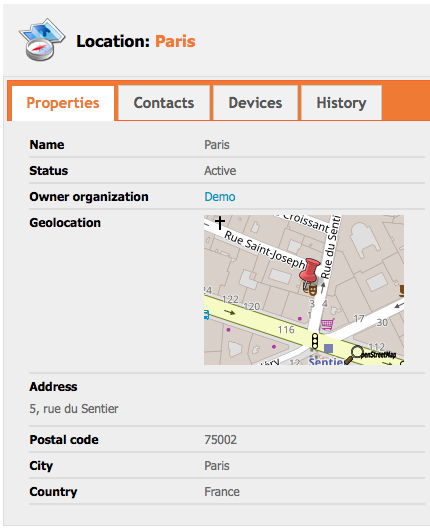
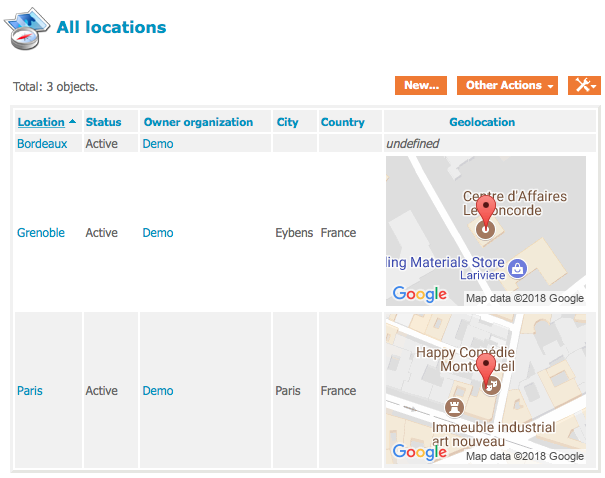

Geolocation
===========

The module `sv-geolocation` is an [iTop](https://www.combodo.com/itop-193) extension to add a new attribute type called `AttributeGeolocation` to provide geographic coordinates.
This new attribute type is added to the `Location` class as a new field.
The module also provides a new dashboard dashlet `GeoMap` which adds an interactive map.

Installation
------------

Place this in the `extensions` folder of your iTop instance and run iTop setup again.
Be sure to enable the extension during setup.

Configuration
-------------

After installation, it is possible to change some settings in order to let this module fully function.

### provider

Specify the provider you want to use for maps.
Currently, only Google Maps is supported for interactive maps.

* `GoogleMaps`
* `OpenStreetMaps`
* `MapQuest`

### api_key

Depending on the provider you are using, you might need to enter the API key.

To use maps from Google Maps, you will need to [acquire an API key](https://developers.google.com/maps/documentation/javascript/get-api-key).

### staticmapurl

This value depends on which map provider (GM, OSM, ...) you want to use for thumbnails.
It only needs to be set if you want to override the default behaviour.

Depending on each map provider, there are several paremeters to give.
The following parameters will be filled in:

1. Latitude from the object.
2. Longitude from the object.
3. Width from datamodel.
4. Height from datamodel.
5. API key from configuration.
6. Zoom from configuration.

Example values for `staticmapurl`:
* [Google Maps](https://developers.google.com/maps/documentation/static-maps/intro):
`https://maps.googleapis.com/maps/api/staticmap?markers=%f,%f&size=%dx%d&key=%s`.
* [Open Street Map](https://wiki.openstreetmap.org/wiki/StaticMapLite):
`http://staticmap.openstreetmap.de/staticmap.php?center=%1$f,%2$f&markers=%1$f,%2$f,red-pushpin&size=%3$dx%4$d&zoom=%6$d`
* [MapQuest](https://developer.mapquest.com/documentation/static-map-api/v5/):
`https://www.mapquestapi.com/staticmap/v5/map?locations=%f,%f&size=%d,%d&key=%s&zoom=%d`

### default_latitude

This is the default latitude when a new dashlet is displayed.

### default_longitude

This is the default longitude when a new dashlet is displayed.

### default_zoom

This is the default zoom for dashlet maps and for static maps.
Note that by default, the static map from Google Maps have a dynamic zoom level.
If you want a fixed zoom level, you will need to reflect this in the parameter `staticmapurl`. 

XML Data Model Reference
------------------------

Field type is `AttributeGeolocation`.

### Definition

* sql _(mandatory)_
The column used to store the value into the MySQL database.
* default_value _(mandatory)_
The default value (can be specified as an empty string).
* is_null_allowed _(mandatory)_
Set to "true" to let users leave this value undefined, false otherwise.
* width _(optional)_
Width of the static image, in pixels.
Defaults to 200.
* height _(optional)_
Height of the static image, in pixels.
Defaults to 150.

### Example

```xml
<field id="geo" xsi:type="AttributeGeolocation">
    <sql>geo</sql>
    <default_value/>
    <is_null_allowed>true</is_null_allowed>
    <width>200</width>
    <height>150</height>
</field>
```

XML Dashboard Reference
-----------------------

Dashlet type is `GeoMap`.

### Definition

* rank _(mandatory)_
Display rank.
* height _(optional)_
Height of the interactive map.
Defaults to 600.
* query _(mandatory)_
The OQL query to select the objects to be placed on the map.
* attribute _(mandatory)_
The geolocation attribute to use for placing the object on the map.

### Example

```xml
<dashlet id="1" xsi:type="GeoMap">
    <rank>1</rank>
    <height>500</height>
    <query>SELECT Location</query>
    <attribute>geo</attribute>
</dashlet>
```

Preview
-------

### Location detail view


### Location list view

