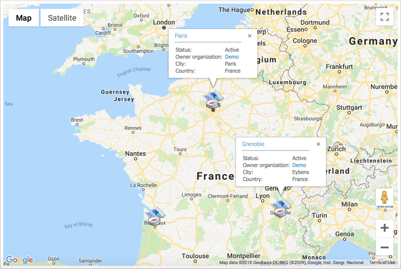

# Geolocation

The module `sv-geolocation` is an [iTop](https://www.combodo.com/itop-193) extension to add a new attribute type called `AttributeGeolocation` to provide geographic coordinates.
This new attribute type is added to the `Location` class as a new field.
The module also provides a new dashboard dashlet `GeoMap` which adds an interactive map.

## Installation

Place this in the `extensions` folder of your iTop instance and run iTop setup again.
Be sure to enable the extension during setup.

## Configuration

After installation, it is possible to change some settings in order to let this module fully function.

### provider

Specify the provider you want to use for interactive maps.

* `GoogleMaps`
* `MapLibre`
  * `MapTiler`
  * `OpenStreetMap`
  * `MapQuest`

### api_key

Depending on the provider you are using, you might need to enter the API key.

How to get API keys for:

* [Google Maps](https://developers.google.com/maps/documentation/javascript/get-api-key)
* [MapTiler](https://docs.maptiler.com/cloud/api/authentication-key/#api-key)
* [MapQuest](https://developer.mapquest.com/documentation/)

### staticmapurl

This value depends on which map provider (GM, OSM, ...) you want to use for thumbnails.
It only needs to be set if you want to override the default behaviour.

Depending on each map provider, there are several parameters to give.
The following parameters will be filled in:

1. Latitude from the object.
2. Longitude from the object.
3. Width from datamodel.
4. Height from datamodel.
5. API key from configuration.
6. Zoom from configuration.

Example values for `staticmapurl`:

* [Google Maps](https://developers.google.com/maps/documentation/static-maps/intro):
`https://maps.googleapis.com/maps/api/staticmap?markers=%f,%f&size=%dx%d&key=%s`.
* [MapQuest](https://developer.mapquest.com/documentation/static-map-api/v5/):
`https://www.mapquestapi.com/staticmap/v5/map?locations=%f,%f&size=%d,%d@2x&key=%s&zoom=%d`
* [MapTiler](https://docs.maptiler.com/cloud/api/static-maps/):
`https://api.maptiler.com/maps/bright-v2/static/auto/%3$dx%4$d@2x.png?markers=%1$f,%2$f&key=%5$s`

Note that you can also use [QR Code Generator](http://goqr.me/api/doc/create-qr-code/) as thumbnail generator.
The resulting value for `staticmapurl` then looks like: `https://api.qrserver.com/v1/create-qr-code/?data=geo:%f,%f&size=%dx%d`

### style

When using a MapLibre provider, you can use a custom [style specification](https://maplibre.org/maplibre-gl-js/docs/style-spec/).
The value is either a URL to the style JSON file or a representation of the style.

The module has default values for the following providers:

* [MapTiler](https://docs.maptiler.com/cloud/api/maps/#style-json-of-the-map):
`https://api.maptiler.com/maps/bright-v2/style.json?key=YOUR_MAPTILER_API_KEY`
* OpenStreetMap
* MapQuest

### default_latitude

This is the default latitude when a new dashlet is displayed.

### default_longitude

This is the default longitude when a new dashlet is displayed.

### default_zoom

This is the default zoom for dashlet maps and for static maps.
Note that by default, the static map from Google Maps have a dynamic zoom level.
If you want a fixed zoom level, you will need to reflect this in the parameter `staticmapurl`.

### display_coordinates

This value specifies if the coordinates of the geolocation also should be shown under the thumbnail.
This is enabled by default.
Note that when you don't have thumbnails, the coordinates will always be displayed.

## XML Data Model Reference

Field type is `AttributeGeolocation`.

### Definition

* sql _(mandatory)_
The column used to store the value into the MySQL database.
* default_value _(mandatory)_
The default value (can be specified as an empty string).
* is_null_allowed _(mandatory)_
Set to "true" to let users leave this value undefined, "false" otherwise.
* width _(optional)_
Width of the static image, in pixels.
Defaults to 200.
* height _(optional)_
Height of the static image, in pixels.
Defaults to 150.

### Example

```xml
<field id="geo" xsi:type="AttributeGeolocation">
    <sql>geo</sql>
    <default_value/>
    <is_null_allowed>true</is_null_allowed>
    <width>200</width>
    <height>150</height>
</field>
```

## XML Dashboard Reference

Dashlet type is `DashletGeoMap`.

### Definition

* rank _(mandatory)_
Display rank.
* height _(optional)_
Height of the interactive map.
Defaults to 600.
* search _(optional)_
Whether to activate address search.
Defaults to "false".
* query _(mandatory)_
The OQL query to select the objects to be placed on the map.
* attribute _(mandatory)_
The geolocation attribute to use for placing the object on the map.

### Example

```xml
<dashlet id="1" xsi:type="DashletGeoMap">
    <rank>1</rank>
    <height>500</height>
    <search>true</search>
    <query>SELECT Location</query>
    <attribute>geo</attribute>
</dashlet>
```

## Notifications

This module also adds some functions to choose the coordinate system when the attribute is used in notifications.

### Representations

* `$this->geo$` or `$this->wgs_84(geo)$`: Display the coordinates in [EPSG:4326](https://epsg.io/4326) (lat,lon).
* `$this->rd(geo)$` or `$this->rijksdriehoek(geo)$`: Display the coordinates in [EPSG:28992](https://epsg.io/28992) (X,Y).
* `$this->html(geo)$`: HTML representation just like in the detail or list view.

## Preview

### Location detail view


### Location list view


### Dashboard Dashlet



## Contribute

### Translation

Translations can be submitted via [Transifex](https://www.transifex.com/super-visions/sv-geolocation/).
Please create a new issue if you want a new language to be added to the project.
